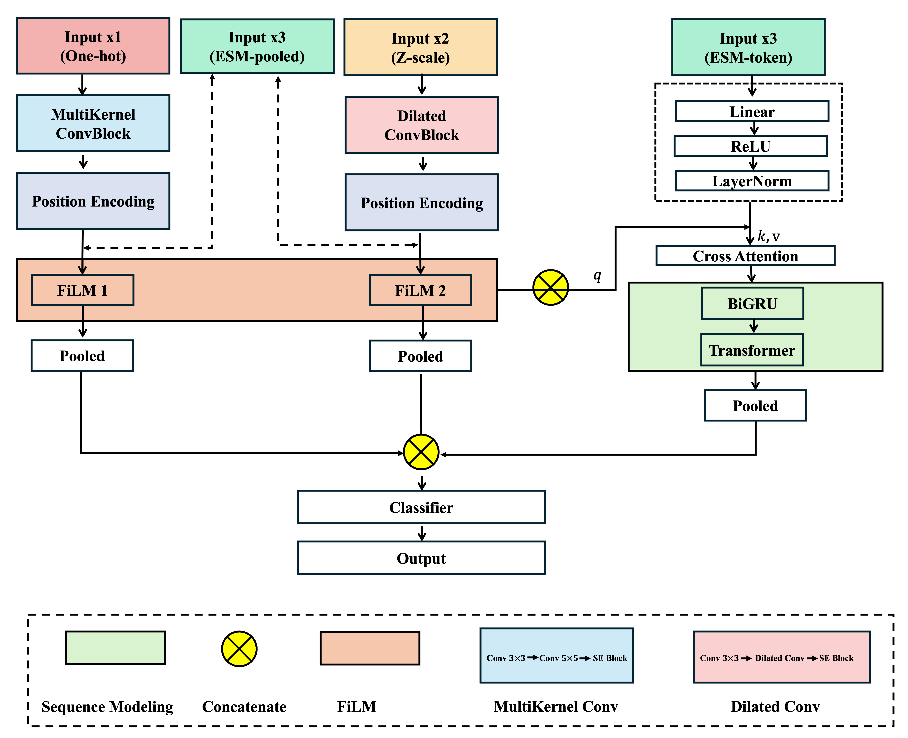

# Multimodal Feature Fusion Network for Anticancer Peptide Prediction

This repository contains the source code for the paper:
"Multimodal Feature Fusion Network for Anticancer Peptide Prediction"
Authors: Yu Zhang  
Year: 2025
---

##  Overview

MFF-ACP is a multimodal deep learning framework designed for accurate anticancer peptide (ACP) prediction.  
The model leverages complementary information from sequence patterns, physicochemical properties, and protein language model embeddings to improve robustness and generalization.

MFF-ACP integrates three heterogeneous feature modalities:

- **Binary Profile Feature (BPF)** encoding for local residue-level patterns  
- **Z-scale physicochemical descriptors** capturing global chemical properties  
- **ESM embeddings** providing rich semantic and evolutionary representations  

To effectively fuse these representations, the model employs:

- **Multiscale & Dilated Convolutions** for hierarchical local–global pattern extraction  
- **Squeeze-and-Excitation (SE) Attention** for channel-wise recalibration  
- **FiLM modulation** to inject cross-modal conditioning  
- **Multi-head Cross-Attention** for deep semantic alignment  
- **BiGRU and Transformer layers** to capture long-range contextual dependencies  

Extensive experiments on multiple benchmark ACP datasets demonstrate that MFF-ACP achieves stable and consistent improvements over state-of-the-art methods, reaching ~90% accuracy and ~0.95 AUC, highlighting its strong generalization ability in ACP prediction.

---
##  Repository Structure
MFF-ACP/
│── checkpoints/
│── data/
│── models/
│── preprocess/
│── results/
│── tools/
│── utils/
│── train.py
│── eval.py
│── requirements.txt
│── README.md
│── MFF_ACP.png          


##  Checkpoints & Results Storage
To reduce repository size and accelerate code access during review, the pretrained model checkpoints and experimental results are not included in this GitHub repository.

They are hosted on Google Drive and can be accessed via the following links:

Checkpoints (pretrained models):
https://drive.google.com/file/d/1wK-aUZu9OveWrraVFq7gZh_O50FCch6j/view?usp=drive_link

Results (evaluation logs, metrics, plots):
https://drive.google.com/file/d/1rRbJsbRwCvzSO3-u_gXCm71bE1zVF_Xm/view?usp=drive_link

Please download these resources before running evaluation or replication experiments.

##  Model Architecture (MFF-ACP)


##  Quick start
1. Install dependencies
pip install -r requirements.txt

2. Train the model
```bash
python train.py --dataset ACP740
```

3. Evaluate 
```bash
python eval.py --dataset ACP740
```

